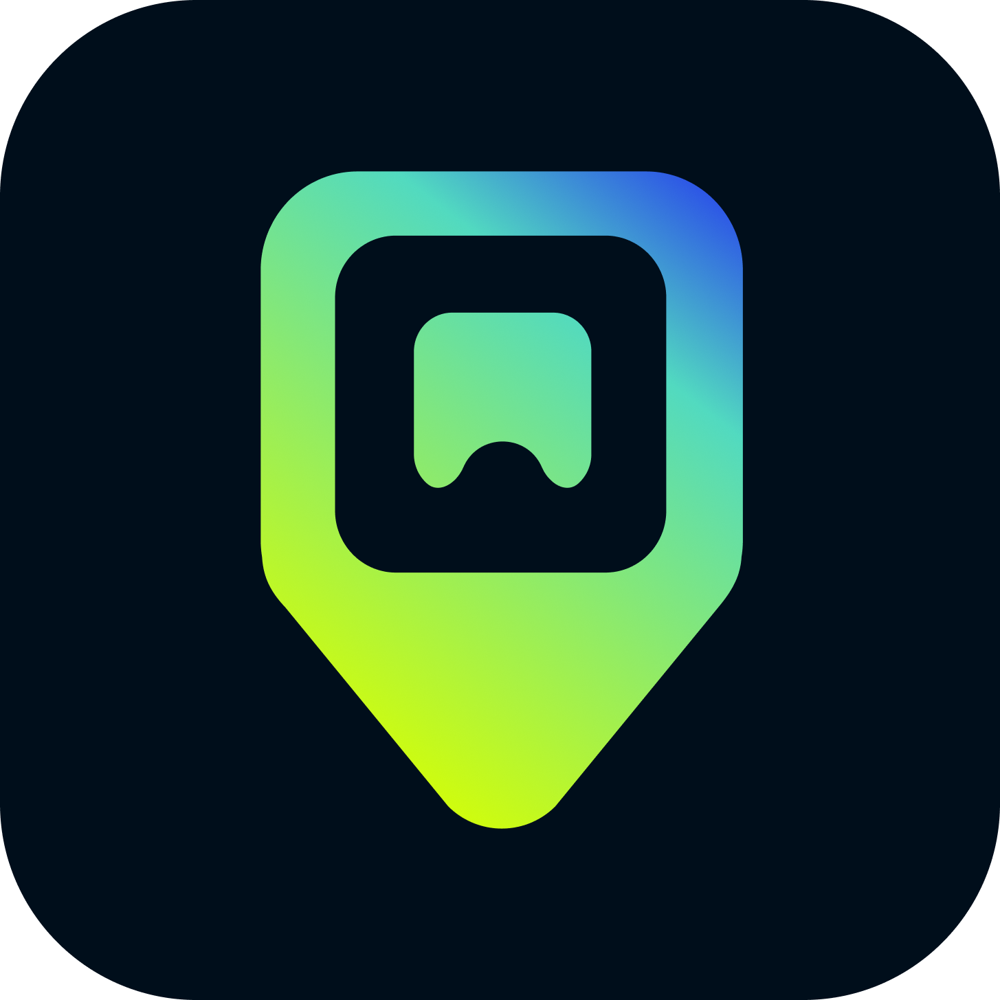

# iBalik 🔍

A Gamified Lost and Found Application for West Visayas State University - Main Campus



## 📖 Overview

**iBalik** is an innovative mobile application designed to streamline the lost and found process at WVSU-Main Campus. By combining social responsibility with gamification elements, iBalik encourages students and staff to actively participate in returning lost items to their rightful owners while earning rewards and building a helpful community.

## ✨ Key Features

### 🎯 Core Functionality
- **Post Found Items**: Users can easily report items they've found with photos, descriptions, and location details
- **Claim Lost Items**: Search and claim lost items through a streamlined verification process
- **Real-time Notifications**: Get instant updates about claims, matches, and important activity
- **Contact Integration**: Multiple contact methods (Phone, Facebook Messenger, Email) for easy communication

### 🎮 Gamification System
- **Points & Levels**: Earn points for posting items, successful returns, and helping others
- **XP & Progression**: Level up your account as you contribute to the community
- **Karma System**: Build reputation through positive actions and verified returns
- **Badges & Achievements**: Unlock special badges for milestones and accomplishments
- **Challenges**: Complete daily and weekly challenges for bonus rewards
- **Streaks**: Maintain activity streaks for additional points
- **Leaderboards**: Compete with other users on various metrics

### 🏢 Drop-off System
- **Keep with Me**: Handle returns directly through the app
- **Drop-off Locations**: Partner with official campus locations (Student Council, various colleges)
- **Preliminary Points**: Earn bonus points for using official drop-off locations
- **Verified Handling**: Professional facilitation through authorized staff

### 🔒 Safety & Verification
- **Item Verification**: Multi-step verification process to ensure rightful ownership
- **Security Questions**: Claimants must answer verification questions about the item
- **Photo Verification**: Visual confirmation through uploaded images
- **Location Tracking**: Precise location details for where items were found
- **Activity Logging**: Complete history of all user actions and transactions

### 📱 User Experience
- **10-Minute Posting Cooldown**: Prevents spam while maintaining system integrity
- **Category Organization**: Items sorted by type (Electronics, Personal Items, Bags, Documents, etc.)
- **Location-based Search**: Filter by campus locations (Library, Colleges, Buildings, etc.)
- **Image Gallery**: Up to 5 high-quality photos per item
- **Responsive Design**: Clean, modern interface with smooth animations
- **Real-time Updates**: Live data synchronization across all devices

## 🛠️ Technology Stack

### Frontend
- **Flutter**: Cross-platform mobile development framework
- **Dart**: Programming language for Flutter applications

### Backend & Services
- **Firebase**:
  - Authentication: Secure user authentication and management
  - Cloud Firestore: Real-time NoSQL database for posts, claims, and user data
  - Cloud Functions: Serverless backend logic
- **Supabase Storage**: Free image storage solution (25GB free tier)
- **Cloudinary**: Additional image hosting and optimization

### Key Packages & Libraries
- `firebase_core`, `firebase_auth`, `cloud_firestore`: Firebase integration
- `supabase_flutter`: Supabase client for Flutter
- `image_picker`: Camera and gallery access for photo uploads
- `flutter_image_compress`: Image optimization before upload
- `permission_handler`: Runtime permission management
- `shared_preferences`: Local data persistence
- `cached_network_image`: Image caching for performance
- `shimmer`: Loading state animations
- `flutter_staggered_animations`: Smooth UI transitions
- `url_launcher`: External link handling
- `intl`: Date formatting and internationalization

## 📊 Database Structure

### Collections
- **users**: User profiles, stats, and game progression
  - Subcollections: `badges`, `challenges`, `activities`
- **lost_items**: All posted found items
- **claims**: Claim submissions and verification records
- **notifications**: User notifications and alerts
- **leaderboards**: Ranking data and statistics

### User Statistics Tracked
- Points, Level, Karma, XP
- Items Posted, Items Returned
- Claims Made, Claims Approved
- Current Streak, Longest Streak
- Badges Earned, Challenges Completed

## 🎨 Design Features

- **Modern UI/UX**: Clean, intuitive interface following Material Design principles
- **Gradient Themes**: Eye-catching purple and teal color scheme
- **Animated Widgets**: Smooth transitions and micro-interactions
- **Responsive Layouts**: Optimized for various screen sizes
- **Loading States**: Shimmer effects and progress indicators
- **Error Handling**: User-friendly error messages and recovery options

## 🚀 Getting Started

### Prerequisites
- Flutter SDK (^3.10.0)
- Android Studio / Xcode (for mobile development)
- Firebase account with project setup
- Supabase account (optional, for storage)

### Installation

1. **Clone the repository**
   ```bash
   git clone https://github.com/meagenotmage/iBalik.git
   cd iBalik
   ```

2. **Install dependencies**
   ```bash
   flutter pub get
   ```

3. **Configure Firebase**
   - Add your `google-services.json` to `android/app/`
   - Add your `GoogleService-Info.plist` to `ios/Runner/`
   - Update `lib/firebase_options.dart` with your configuration

4. **Configure Supabase** (if using)
   - Update Supabase credentials in the app
   - Set up storage buckets: `lost-items`, `profile-images`

5. **Run the app**
   ```bash
   flutter run
   ```

### Building Release APK

```bash
flutter build apk --release
```

The APK will be located at: `build/app/outputs/flutter-apk/app-release.apk`

## 📱 App Configuration

### Android
- **Package Name**: `com.example.flutter_ibalik`
- **Min SDK**: 21 (Android 5.0)
- **Target SDK**: 34
- **Compile SDK**: 36
- **Version**: 1.0.0 (Build 1)

### Permissions Required
- Internet access (Firebase/Supabase)
- Camera (photo capture)
- Photo library/Gallery access
- Network state

## 🏗️ Project Structure

```
lib/
├── main.dart                 # App entry point
├── firebase_options.dart     # Firebase configuration
├── models/                   # Data models
│   └── game_models.dart
├── screens/                  # UI screens
│   ├── auth/                # Authentication screens
│   ├── claims/              # Claim management
│   ├── game/                # Gamification features
│   ├── home/                # Home dashboard
│   ├── notifications/       # Notifications
│   ├── posts/               # Post management
│   └── store/               # Future store feature
├── services/                # Business logic
│   ├── activity_service.dart
│   ├── auth_service.dart
│   ├── game_service.dart
│   ├── lost_item_service.dart
│   ├── notification_service.dart
│   └── storage services
└── utils/                   # Utilities and widgets
    └── animated_widgets.dart
```

## 🎓 Campus Locations Supported

### Where Items Can Be Found
- Library
- CO-OP
- College of ICT
- College of Nursing
- College of Law
- Research Building
- Various academic buildings and facilities

### Drop-off Locations
- College offices
- Student Council
- Guard House
- Library
- And more...

## 🔐 Security & Privacy

- User authentication through Firebase
- Secure data transmission
- Privacy-focused design
- No sharing of personal information without consent
- Role-based access control
- Activity logging for accountability

## 🤝 Contributing

This project is part of an academic assessment. For suggestions or issues, please contact the developers.

## 📄 License

This project is developed as part of the Alternative Learning Assessment for Applications Development and Emerging Technologies course at West Visayas State University.

## 👥 Development Team

**Developers**:
- Kyla Elijah Ramiro
- Meagelleine Rose Sionosa

**Course**: Applications Development and Emerging Technologies  
**Institution**: West Visayas State University - Main Campus  
**Year**: 2025

## 📞 Contact & Support

For questions, suggestions, or support:
- Open an issue in the repository
- Contact the development team through WVSU channels

## 🙏 Acknowledgments

- West Visayas State University for the opportunity
- WVSU community for testing and feedback
- Open-source Flutter and Firebase communities
- All contributors and supporters

---

© 2025 Kyla Elijah Ramiro & Meagelleine Rose Sionosa. All rights reserved.

**Made with ❤️ for the WVSU Community**
